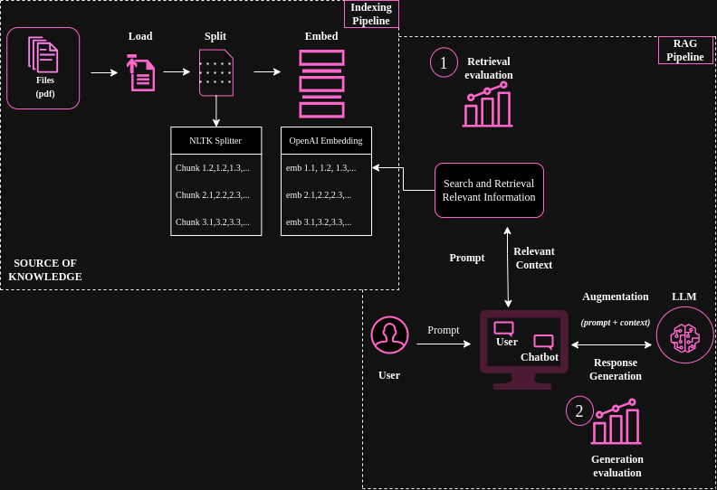

# RAG Evaluation Project

This is a preliminary project for evaluating a Retrieval Augmented Generation (RAG) application using RAGAs.

## Overview

This functionality aims to evaluate a system that operates as follows:

For more information, please refer to the [RAGAs documentation](https://docs.ragas.io/en/stable/index.html).

## Usage

To use this project, follow these steps:

1. Clone the repository.
2. Install the necessary dependencies using requirements.txt.
3. Run the evaluation process via Jupyter Notebook.
4. To properly execute step 3, you should create an .env file with the OpenAI API key credentials and also create a doc/ directory within the project to upload the documents that you want to use for extracting information.

## Documentation

For detailed documentation, including setup instructions and usage guidelines, please refer to the [documentation](https://docs.example.com).

## Contributing

Contributions are welcome! If you find any issues or have suggestions for improvement, please open an issue or submit a pull request.

## License

This project is licensed under the [MIT License](LICENSE).
